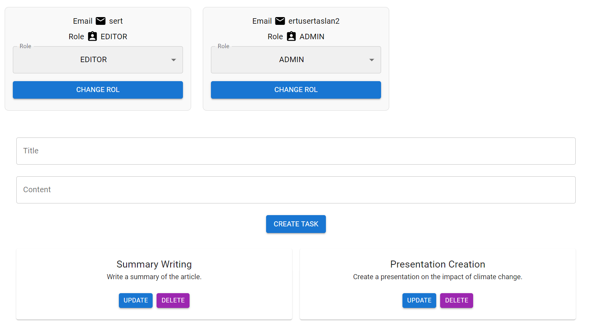
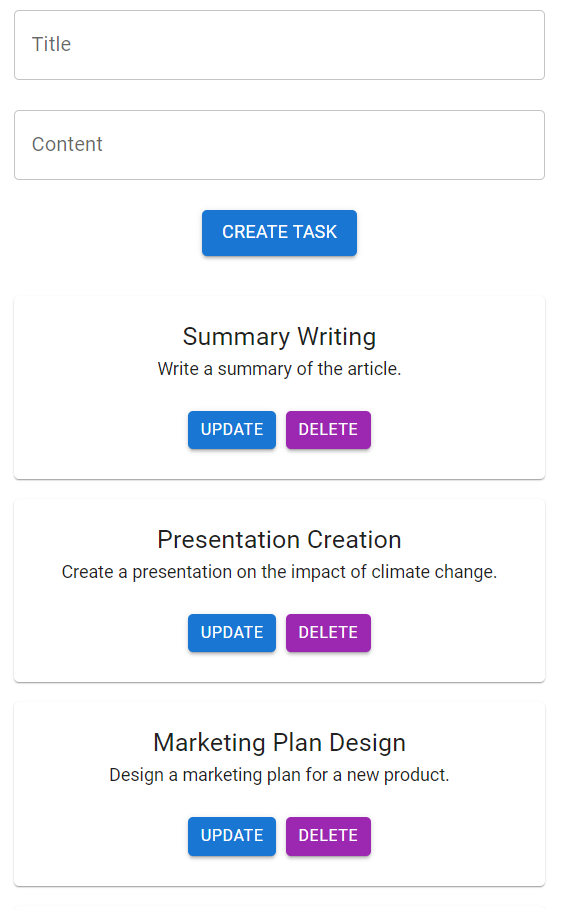
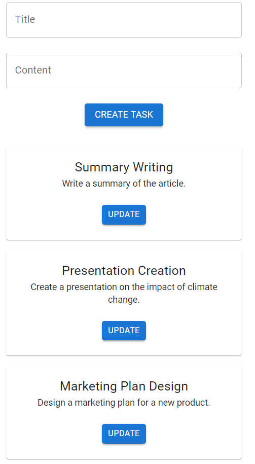
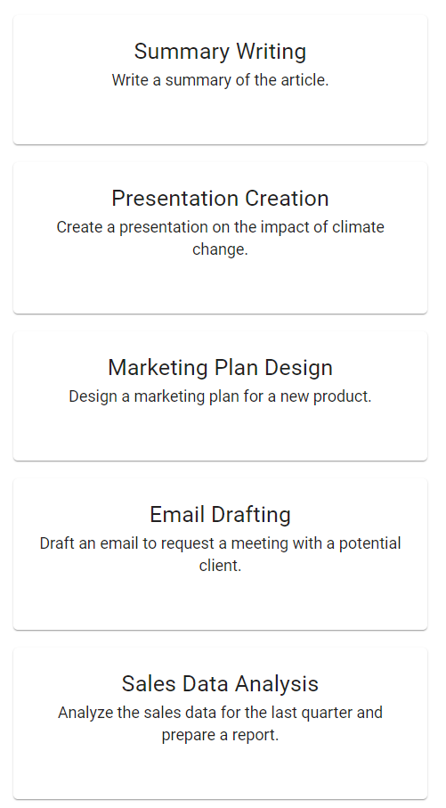

# 🗂️ Task Management Application 🚀


This application is designed for managing tasks with varying user roles and permissions. It provides a structured approach to task management with role-based access control to ensure efficient task handling and user management.

## Features

- **🗂️ Task Management**: Users can create, view, edit, and delete tasks based on their role.
- **👥 User Role Management**: Assign different roles to users with specific permissions.
- **🔐 Role-based Permissions**: Control user access and actions within the application.

## Technologies Used 💻

### Frontend 🎨
- ⚙️ [Material-UI (MUI)](https://mui.com) - React components for faster and easier web development.
- 🛤️ [React Router](https://reactrouter.com/en/main) - Declarative routing for React applications.
- 🌐 [Axios](https://axios-http.com) - Promise-based HTTP client for making API requests.
- 💻 [React.js](https://reactjs.org/) - JS library for crafting user interfaces
- ⚡ [Vite](https://vitejs.dev/) - Module bundler

### Backend 🖥️

- 🚀 [Express.js](https://expressjs.com/) - Web framework for Node.js
- 🔑 [JWT](https://jwt.io/) - Mechanism for integrating application 
- 🌐 [Cors](https://www.npmjs.com/package/cors/) - Mechanism for integrating applications
- ⚙️ [Dotenv](https://www.npmjs.com/package/dotenv/) - A zero-dependency module that loads environment variables from a .env file into process.env
s


 ### Database 🗃️
- 🛢️ [Prisma](https://www.prisma.io/) - Prisma ORM is an open-source next-generation ORM
- 🐘 [PostgreSQL](https://www.postgresql.org/) - An advanced, enterprise-class open-source relational database
- 🐳 [Docker](https://www.docker.com/) - A software platform that allows you to build, test, and deploy applications quickly 
## User Roles

1. **👁️ Viewer**:
   - **Permissions**: View tasks only.
   - **Restrictions**: Cannot add, edit, or delete tasks.

2. **📝 Editor**:
   - **Permissions**: View, add, and edit tasks.
   - **Restrictions**: Cannot delete tasks.

3. **🛠️ Admin**:
   - **Permissions**: View, add, edit, and delete tasks.
   - **Restrictions**: Cannot manage users or roles.

4. **🌟 Superadmin**:
   - **Permissions**: All Admin privileges plus manage users and assign roles.
   - **Restrictions**: None.

## Install & Build 🔧

Prerequisites

- Install Node.js ⚙️
- Clone the repo 🔄

📦 After cloning the repo install dependecies with

 ```sh 
  npm i
```
📡 To run development server use dev script
 ```sh 
  npm run dev
```
🔧 To build use build script
 ```sh 
  npm run build
```
after running scripts go to http://localhost:5173 with your browser to use the app. 🌐


### Screenshots 📸
<div>
<div>
  <h2>Super Admin Page 🌟</h2>
    
</div>
  <div>
  <div  style="display: flex; justify-content: space-between; width: 100%;"> <h2>Admin Page 🛠️ , Editor Page 📝 and  Viewer Page 👁️ </h2></div>
    
    
    
   
</div>
</div>


## License 📄

[MIT](https://choosealicense.com/licenses/mit/)
